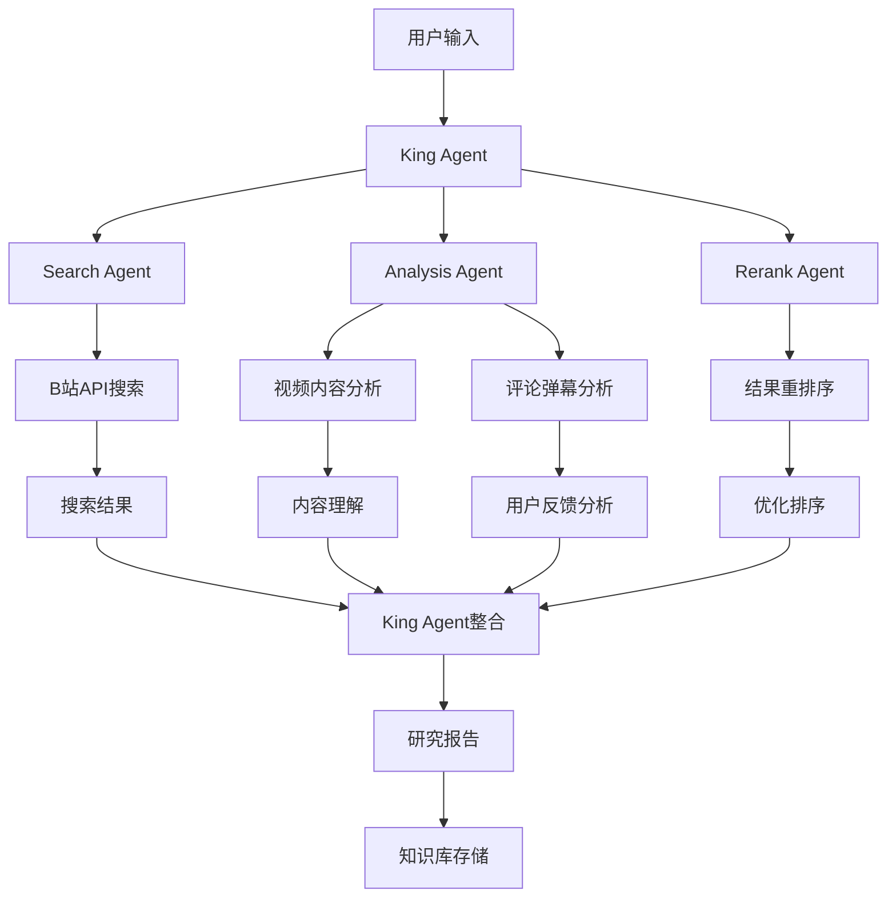

# BILI Library - B站智能知识库系统

> 基于Frame-by-frame-AI-parser修改，通过B站API自动搜索、理解、记录B站视频内容，构建智能知识库系统

[](https://www.python.org)
[](LICENSE)
[](https://github.com)
[](https://github.com/JucieOvo/bili-library)

## 🎯 项目愿景

BILI Library 旨在将B站打造成类似Bing的智能搜索平台，通过AI技术让用户在B站快速获取可靠的知识。项目基于Frame-by-frame-AI-parser进行修改，结合B站API和爬虫技术，实现视频内容的自动搜索、理解和记录。

## ✨ 核心特性

- 🔍 **智能搜索** - 基于B站API的智能视频搜索和检索，支持语义理解
- 💬 **评论分析** - 批量获取和分析视频评论，支持情感分析和关键词提取
- 📊 **弹幕分析** - 提取和分析视频弹幕，支持时间轴分析和词云生成
- 📥 **视频下载** - 支持多种清晰度和格式，断点续传和批量下载
- 🤖 **AI 研究** - 基于LangGraph的多Agent智能研究系统，支持深度分析
- 🧠 **知识管理** - 本地向量存储和RAG检索，支持语义搜索和知识整合
- 🎯 **路径自适应** - 可随意移动项目，路径自动调整，无需配置修改
- 🔐 **安全登录** - 二维码扫码登录，支持Cookie管理和自动刷新
- 📚 **知识库构建** - 自动构建视频知识库，支持批量处理和增量更新

## 🚀 快速开始

### 环境要求

- **Python**: 3.8 或更高版本
- **操作系统**: Windows / Linux / macOS
- **磁盘空间**: 至少10GB（用于模型和缓存）

### 安装步骤

1. **克隆项目**
```bash
git clone https://github.com/JucieOvo/bili-library.git
cd bili-library
```

2. **安装依赖**
```bash
pip install -r requirements.txt
```

3. **验证安装**
```bash
python scripts/verify_paths.py
```

4. **下载模型（可选）**
```bash
python scripts/download_models.py
```

### 启动方式

```bash
# 方式1: 基础下载器
python main.py

# 方式2: 知识库系统
python bili_library.py

# 方式3: 智能研究系统
python bili_research.py

# 方式4: Web界面
python app.py
```

## 🏗️ 技术架构

BILI Library 采用模块化设计，主要包含以下核心组件：

### 前端界面层
- **命令行界面** - 基于Rich库的彩色交互界面
- **Web界面** - 基于Streamlit的Web应用界面
- **API接口** - 统一的RESTful API接口

### 业务逻辑层
- **搜索模块** - B站视频搜索和检索
- **分析模块** - 评论、弹幕、视频内容分析
- **下载模块** - 视频下载和管理
- **知识库模块** - 向量存储和语义检索

### AI智能层
- **多Agent系统** - 基于LangGraph的智能研究框架
- **本地模型** - 支持Qwen3等本地AI模型
- **云端API** - 集成通义千问、OpenAI等云端服务

### 数据存储层
- **向量数据库** - ChromaDB向量存储
- **文件缓存** - 本地文件系统缓存
- **配置管理** - JSON配置文件管理

## 📖 详细功能

### 1. 智能搜索系统

基于B站官方API，支持高级搜索功能：

```python
from search.video_search import VideoSearch
from utils.config import Config

config = Config()
searcher = VideoSearch(config)

# 搜索视频
results = searcher.search_videos("Python教程", page_size=20)

# 获取热门搜索
hot_searches = searcher.get_hot_searches()

# 搜索建议
suggestions = searcher.get_search_suggestions("Python")
```

### 2. 评论分析系统

批量获取和分析视频评论：

```python
from video.comment import CommentAPI

comment_api = CommentAPI(config)

# 获取评论
comments = comment_api.get_comments(bvid="BV1GJ411x7h7", pn=1, ps=20)

# 分析评论情感
sentiment = comment_api.analyze_sentiment(comments)

# 提取关键词
keywords = comment_api.extract_keywords(comments)
```

### 3. 弹幕分析系统

提取和分析视频弹幕：

```python
from video.danmaku import DanmakuFetcher

danmaku_fetcher = DanmakuFetcher(config)

# 获取弹幕
danmaku_list = danmaku_fetcher.get_danmaku(bvid="BV1GJ411x7h7")

# 弹幕时间轴分析
timeline = danmaku_fetcher.analyze_timeline(danmaku_list)

# 弹幕词云生成
wordcloud = danmaku_fetcher.generate_wordcloud(danmaku_list)
```

### 4. 视频下载系统

支持多种清晰度和格式下载：

```python
from video.downloader import VideoDownloader

downloader = VideoDownloader(config)

# 下载视频
result = downloader.download_video(
    bvid="BV1GJ411x7h7", 
    quality=80,  # 1080P高清
    output_dir="downloads"
)

# 批量下载
batch_results = downloader.batch_download(["BV1", "BV2", "BV3"])

# 断点续传支持
downloader.enable_resume = True
```

### 5. AI研究系统

基于LangGraph的多Agent架构：

```python
from agents.workflow import MultiAgentWorkflow

# 创建研究流程
workflow = MultiAgentWorkflow(config)

# 执行智能研究
research_result = workflow.research("回村三天，二舅治好了我的精神内耗")

# 获取研究报告
report = research_result.get_report()
```

### 6. 知识库系统

本地向量存储和语义搜索：

```python
from knowledge.knowledge_base import KnowledgeBase
from knowledge.vector_store import VectorStore

# 创建知识库
kb = KnowledgeBase(config)

# 添加视频知识
kb.add_video_knowledge(bvid="BV1GJ411x7h7")

# 语义搜索
results = kb.semantic_search("Python编程教程")

# 向量存储
vector_store = VectorStore(config)
vector_store.add_documents(knowledge_items)
```

## 📂 项目结构

```
BILI library/
├── agents/                  # AI代理模块
│   ├── base_agent.py       # 基础Agent类
│   ├── king_agent.py       # King Agent（协调者）
│   ├── search_agent.py     # 搜索Agent
│   ├── analysis_agent.py   # 分析Agent
│   ├── rerank_agent.py     # 重排序Agent
│   └── workflow.py         # 工作流管理
├── knowledge/              # 知识管理模块
│   ├── knowledge_base.py   # 知识库核心
│   ├── vector_store.py     # 向量存储
│   ├── rag_engine.py       # RAG引擎
│   ├── frame_analyzer.py   # 视频帧分析
│   └── research_manager.py # 研究管理
├── video/                  # 视频处理模块
│   ├── downloader.py       # 视频下载
│   ├── comment.py          # 评论处理
│   ├── danmaku.py          # 弹幕处理
│   └── info.py            # 视频信息
├── search/                 # 搜索模块
│   ├── video_search.py     # 视频搜索
│   └── hot.py             # 热门搜索
├── auth/                   # 认证模块
│   └── qrcode_login.py     # 二维码登录
├── utils/                  # 工具模块
│   ├── config.py          # 配置管理
│   ├── http_client.py      # HTTP客户端
│   ├── llm_client.py       # LLM客户端
│   └── logger.py          # 日志管理
├── scripts/               # 工具脚本
│   ├── verify_paths.py    # 路径验证
│   ├── download_models.py # 模型下载
│   └── check_logic_errors.py # 逻辑检查
├── examples/              # 示例代码
│   ├── quick_start.py     # 快速开始
│   ├── research_demo.py   # 研究演示
│   └── rerank_demo.py     # 重排序演示
├── config.json           # 配置文件
├── main.py              # 主程序入口
├── bili_library.py      # 知识库入口
├── bili_research.py     # 研究系统入口
└── app.py              # Web界面入口
```

## 🔧 配置说明

### 默认配置

项目使用相对路径配置，自动适应项目位置：

```json
{
  "paths": {
    "download_dir": "downloads",
    "cache_dir": "cache", 
    "log_dir": "logs",
    "temp_dir": "temp",
    "models_dir": "models"
  },
  "api": {
    "bilibili": {
      "base_url": "https://api.bilibili.com"
    }
  }
}
```

### 自定义配置

支持环境变量和自定义配置：

```bash
# 设置阿里云API密钥
export DASHSCOPE_API_KEY="your-api-key"

# 使用本地模型
export USE_LOCAL_MODELS="true"
```

## 🛠️ 诊断工具

项目提供完整的诊断工具集：

```bash
# 验证路径配置
python scripts/verify_paths.py

# 检查逻辑错误
python scripts/check_logic_errors.py

# 测试路径可移植性
python scripts/test_path_portability.py

# 检查空值处理
python scripts/check_none_handling.py
```

## 📦 模型管理

### 支持的模型

- **文本嵌入**: Qwen3-Embedding-0.6B（本地）
- **重排序**: Qwen3-Rerank-0.6B（本地）
- **大语言模型**: 通义千问 / OpenAI GPT（云端）

### 模型下载

```bash
python scripts/download_models.py

# 选择下载：
# 1. Embedding模型 (~2GB)
# 2. Rerank模型 (~2GB)  
# 3. 所有模型 (~4GB)
```

## 🌟 特色功能

### 🎯 Frame-by-frame-AI-parser集成

基于Frame-by-frame-AI-parser的修改，实现视频内容的深度理解：

```python
from knowledge.frame_analyzer import FrameAnalyzer

# 视频帧分析
frame_analyzer = FrameAnalyzer(config)
analysis_result = frame_analyzer.analyze_video_frames(
    video_path="video.mp4", 
    frame_interval=10  # 每10帧分析一次
)

# 获取关键帧分析
key_frames = analysis_result.get_key_frames()
content_summary = analysis_result.get_content_summary()
```

### 🔄 路径自动适应

项目可以随意移动到任何位置，所有路径自动调整：

```bash
# 移动项目到新位置
mv "/old/path/bili-library" "/new/path/bili-library"

# 直接运行，路径自动更新
cd "/new/path/bili-library"
python main.py  # ✅ 正常工作
```

### 💾 智能缓存系统

自动缓存避免重复请求，支持增量更新：

- **评论缓存**: `cache/comments/` - 评论数据和情感分析结果
- **弹幕缓存**: `cache/danmaku/` - 弹幕数据和时间轴分析
- **搜索缓存**: `cache/search/` - 搜索结果和语义索引
- **向量缓存**: `cache/vectors/` - 向量化数据和相似度索引
- **知识库缓存**: `cache/knowledge_base/` - 知识条目和关联关系

### 🤖 多Agent智能研究架构

基于LangGraph的多Agent系统，实现智能视频研究：



### 📚 知识库构建流程

完整的知识库构建和管理流程：

1. **视频发现** - 通过搜索和推荐发现相关视频
2. **内容获取** - 获取视频信息、评论、弹幕等数据
3. **AI分析** - 使用AI技术分析视频内容
4. **知识提取** - 从分析结果中提取有价值的知识
5. **向量存储** - 将知识向量化并存储到向量数据库
6. **语义检索** - 支持基于语义的知识检索

### 🔍 B站作为搜索平台

将B站打造成类似Bing的智能搜索平台：

- **内容多样性** - 涵盖教育、科技、娱乐等多个领域
- **实时性** - 获取最新的视频内容和用户反馈
- **可靠性** - 基于用户评论和弹幕的内容质量评估
- **知识密度** - 高质量的教育和知识分享内容

## 🎯 使用示例

### 基础使用

```python
# 快速开始示例
from examples.quick_start import demo_basic_usage

demo_basic_usage()
```

### 智能研究

```python
# 研究演示
from examples.research_demo import demo_research_system

demo_research_system("人工智能发展趋势")
```

### RAG检索

```python
# 重排序演示
from examples.rerank_demo import demo_rerank_system

demo_rerank_system("Python编程教程")
```

## 🎯 使用示例

### 基础使用

```python
# 快速开始示例
from examples.quick_start import demo_basic_usage

demo_basic_usage()
```

### 智能研究

```python
# 研究演示
from examples.research_demo import demo_research_system

demo_research_system("人工智能发展趋势")
```

### RAG检索

```python
# 重排序演示
from examples.rerank_demo import demo_rerank_system

demo_rerank_system("Python编程教程")
```

## 🎯 实际应用场景

### 教育研究
- **课程学习** - 搜索相关教学视频，构建知识图谱
- **学术研究** - 分析特定领域的视频内容和用户反馈
- **技能提升** - 通过视频教程学习新技能

### 内容分析
- **趋势分析** - 分析热门话题和内容趋势
- **用户行为** - 研究用户评论和弹幕行为模式
- **质量评估** - 基于AI分析评估视频内容质量

### 知识管理
- **个人知识库** - 构建个人专属的视频知识库
- **团队协作** - 共享和检索团队知识资源
- **内容推荐** - 基于语义理解的个性化推荐

## 🚀 部署指南

### 本地部署

```bash
# 1. 克隆项目
git clone https://github.com/JucieOvo/bili-library.git
cd bili-library

# 2. 安装依赖
pip install -r requirements.txt

# 3. 验证安装
python scripts/verify_paths.py

# 4. 下载模型（推荐）
python scripts/download_models.py

# 5. 启动应用
python main.py  # 命令行界面
# 或
python app.py   # Web界面
```

### Docker部署（可选）

```dockerfile
# Dockerfile
FROM python:3.9-slim

WORKDIR /app
COPY . .
RUN pip install -r requirements.txt

EXPOSE 8501
CMD ["python", "app.py"]
```

### 云服务部署

支持部署到各种云服务平台：
- **AWS** - 使用EC2或Lambda
- **Azure** - 使用App Service
- **Google Cloud** - 使用App Engine
- **阿里云** - 使用函数计算

## 📊 性能优化

### 缓存策略
- 启用智能缓存减少API调用
- 设置合理的缓存过期时间
- 支持缓存预热和增量更新

### 并发处理
- 使用异步IO提高处理效率
- 支持批量操作减少请求次数
- 合理的请求频率控制

### 资源管理
- 自动清理过期缓存文件
- 支持大文件分片下载
- 内存使用监控和优化

## 🔒 安全与合规

### 数据安全
- ✅ 本地数据处理，不存储敏感信息
- ✅ 支持数据加密和访问控制
- ✅ 自动清理临时文件

### 合规使用
- ✅ 基于B站官方API开发
- ✅ 遵守B站用户协议
- ✅ 支持个人学习和研究使用
- ❌ 禁止商业用途和大规模爬取
- ❌ 禁止侵犯版权和用户隐私

## 🤝 贡献指南

欢迎贡献代码！请遵循以下步骤：

1. **Fork 项目** - 点击右上角Fork按钮
2. **创建分支** - `git checkout -b feature/AmazingFeature`
3. **提交更改** - `git commit -m 'Add some AmazingFeature'`
4. **推送分支** - `git push origin feature/AmazingFeature`
5. **创建PR** - 在GitHub上创建Pull Request

### 开发环境设置

```bash
# 设置开发环境
git clone https://github.com/JucieOvo/bili-library.git
cd bili-library

# 安装开发依赖
pip install -r requirements-dev.txt

# 运行测试
python -m pytest tests/

# 代码格式化
black .
flake8 .
```

## 📄 许可证

本项目采用 MIT 许可证 - 查看 [LICENSE](LICENSE) 文件了解详情。

## 🙏 致谢

- [B站官方API文档](https://github.com/SocialSisterYi/bilibili-API-collect) <mcreference link="https://github.com/JucieOvo/bili-library" index="0">0</mcreference>
- [Frame-by-frame-AI-parser](https://github.com) - 视频分析基础框架
- [LangGraph](https://github.com/langchain-ai/langgraph) - 多Agent框架
- [通义千问](https://tongyi.aliyun.com/) - AI模型支持
- [Hugging Face](https://huggingface.co/) - 开源模型社区

## 📞 支持与反馈

如果您遇到问题或有建议：

1. 📖 查看 [使用说明](使用说明.md)
2. ❓ 检查 [常见问题](docs/FAQ.md)
3. 🐛 提交 [Issue](https://github.com/JucieOvo/bili-library/issues)
4. 💬 加入讨论 [讨论](https://github.com/JucieOvo/bili-library/discussions)
5. 📧 联系开发者: [项目邮箱]

## 🔮 未来规划

- [ ] 支持更多视频平台（YouTube、抖音等）
- [ ] 增强多模态理解能力
- [ ] 开发移动端应用
- [ ] 支持实时视频分析
- [ ] 构建知识图谱可视化

---

<div align="center">

## 🎉 开始使用

```bash
git clone https://github.com/JucieOvo/bili-library.git
cd bili-library
pip install -r requirements.txt
python main.py
```

**BILI Library** - 让B站成为你的智能知识搜索引擎！ 🚀

*基于Frame-by-frame-AI-parser修改，通过AI技术让B站视频内容变得可搜索、可理解、可记录* <mcreference link="https://github.com/JucieOvo/bili-library" index="0">0</mcreference>

</div>
